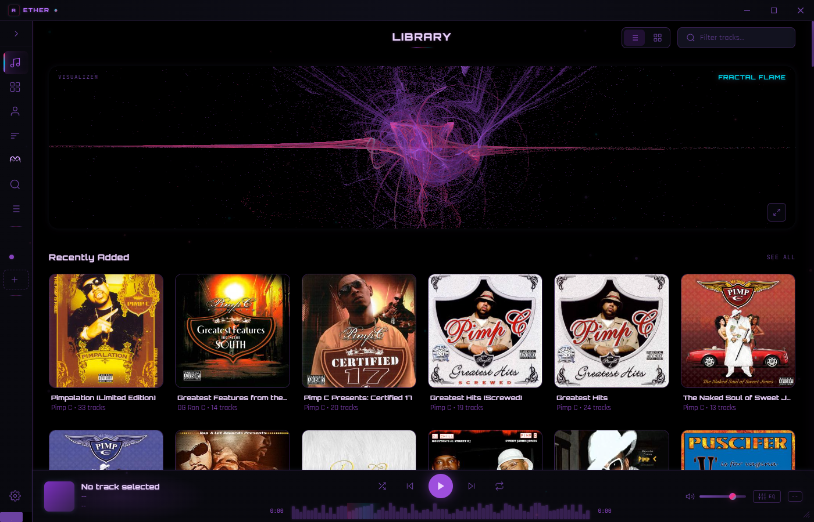

<p align="center">
  
  
  
  
</p>

<h1 align="center">
  <br/>
  <code>[ AETHER ]</code>
  <br/>
  <sub>Audio Engine for Total Harmonic Experience & Rendering</sub>
  <br/>
</h1>

<p align="center">
  <em>Not a music player — an experience.</em>
</p>

<p align="center">
  <strong>OLED-black. Tron-purple. 17 real-time generative visualizers. Rhythmic Binaural Brainwave Layering Engine. Zero compromise.</strong>
</p>

<p align="center">
  <a href="https://github.com/EmperorBadussy/charon">
    
  </a>
</p>

---

<p align="center">
  
</p>

---

<br/>

## `> WHAT IS THIS`

AETHER is a desktop music player built from scratch for people who think Spotify's UI peaked in 2014 and everything since has been a lateral move into beige. It connects to your self-hosted **Navidrome/Subsonic** server, streams your own library, and wraps it in an interface designed for OLED screens with a strict monochromatic purple palette on true black.

Every pixel is intentional. Every animation is buttery. Every visualizer is a canvas-rendered generative art piece that reacts to your music in real time.

<br/>

## `> VISUALIZERS`

17 hand-crafted scenes. All canvas 2D. All 60fps. All beat-reactive.

| # | Scene | Description |
|---|-------|-------------|
| 0 | **Fractal Flame** | Iterative flame algorithm with color-mapped attractors |
| 1 | **Void Pulse** | Concentric rings expanding from center with side particles |
| 2 | **Tron Grid** | Infinite perspective grid with planet, stars, and bass shockwaves |
| 3 | **Particle Field** | Thousands of particles in slow 3D orbit |
| 4 | **Waveform Bars** | Circular frequency bars with trail effects |
| 5 | **Plasma Warp** | Dark undulating plasma fields |
| 6 | **Neural Web** | Connected node network pulsing with audio |
| 7 | **Aurora Borealis** | Northern lights curtains with subtle stars |
| 8 | **DNA Helix** | Double-strand helix with cross-links, 3D camera orbit |
| 9 | **Cosmic Mandala** | Sacred geometry patterns radiating from center |
| 10 | **Electric Sheep** | Video-based fractal flames — audio-reactive speed, hue-rotation, zoom pulse, beat rings |
| 11 | **Bio-Genesis** | Organic organisms with membranes, mitochondria, flagella |
| 12 | **Command Deck** | UFO cockpit — holographic disc, alien telemetry, circular gauges, energy orbs |
| 13 | **Void Pulse II** | Clean concentric ripples — dramatic slow expansion with color-shifting rings |
| 14 | **Neural Web II** | High-reactivity geometric network — multi-color nodes with signal pulses |
| 15 | **DNA Helix II** | Vertical double-strand helix — cyan/magenta strands with depth layering |
| 16 | **Lyric Rain** | Matrix rain with bass shockwaves, frequency-mapped columns, scan lines — LRCLIB lyrics materialize on beats |

Auto-rotate cycles through scenes, or pin your favorite. Every scene has unique beat detection behavior and glow effects that bleed into the UI panel borders.

<br/>

## `> FEATURES`

```
 AUDIO
  ├─ Gapless playback (crossfade, dual audio element strategy)
  ├─ Waveform seek bar (SoundCloud-style, full-width)
  ├─ 10-band parametric EQ with 10 presets (Web Audio API BiquadFilters)
  ├─ Beat detection (FFT analysis, band extraction)
  ├─ Format support: FLAC, MP3, OGG, AAC, WAV, OPUS
  ├─ Volume control with mute toggle
  ├─ LRCLIB lyrics integration (auto-fetch with search fallback)
  └─ RHYTHMIC BINAURAL BRAINWAVE ENGINE (see below)

 LIBRARY
  ├─ Navidrome/Subsonic API integration
  ├─ Albums, Artists, Genres, Binaural, Playlists, Search
  ├─ 100k+ track support (paginated loading)
  ├─ Smart queue management
  ├─ Shuffle (no-repeat algorithm)
  └─ Context menus on tracks

 INTERFACE
  ├─ OLED-optimized (true #000000 black)
  ├─ Monochromatic purple palette (12 shades)
  ├─ Glassmorphism overlays
  ├─ Collapsible sidebar (Library, Albums, Artists, Genres, Binaural, Search, Queue)
  ├─ Horizontal / Vertical layout modes
  ├─ Navigation history with back button
  ├─ Full keyboard shortcut system
  └─ Custom ultra-thin scrollbars

 TECH
  ├─ Electron 33 (frameless, no titlebar)
  ├─ Single-file renderer (player.html — ~8000 lines)
  ├─ Canvas 2D visualizers (no Three.js dependency)
  ├─ Web Audio API (AnalyserNode, FFT 2048)
  ├─ System tray with minimize-to-tray
  ├─ Settings persisted to localStorage
  └─ F12 DevTools toggle
```

<br/>

## `> RHYTHMIC BINAURAL BRAINWAVE LAYERING ENGINE`

**AETHER isn't just a music player — it's a neural entrainment system.**

Built-in binaural beats generator using Web Audio API oscillators. Two sine waves play at slightly different frequencies in each ear — your brain perceives the difference as a "beat" that entrains neural oscillations to specific brainwave states.

### Single Tone Mode
Pick a brainwave preset and go — or dial in custom frequencies with precision sliders.

| Preset | Beat Frequency | Base Frequency | Brain State |
|--------|---------------|----------------|-------------|
| **Delta** | 2 Hz | 150 Hz | Deep sleep |
| **Theta** | 6 Hz | 200 Hz | Meditation |
| **Alpha** | 10 Hz | 200 Hz | Relaxation / Focus |
| **Beta** | 20 Hz | 250 Hz | Alertness |
| **Gamma** | 40 Hz | 300 Hz | Peak cognition |

### Rhythm Layer Mode — This Is The Insane Part

**Stack multiple binaural brainwave frequencies, each pulsing at a different rhythmic division.**

Delta droning on whole notes. Theta pulsing quarter notes. Gamma flickering on sixteenths. All synchronized to a master BPM clock with sample-accurate scheduling.

**Rhythm Presets:**
- **Deep Meditation** — Delta whole notes + Theta halves (60 BPM)
- **Focus Flow** — Alpha quarters + Beta eighths (80 BPM)
- **Lucid Dream** — Delta whole + Theta quarter + Alpha triplet (50 BPM)
- **Peak Performance** — Alpha half + Beta quarter + Gamma eighth (100 BPM)
- **Shamanic Journey** — Theta whole + Delta triplet + Gamma sixteenths (55 BPM)

Build your own layers. Mix with your music. The visualizers react to the binaural tones.

```
 RHYTHM ENGINE ARCHITECTURE
  ├─ Lookahead scheduler (sample-accurate Web Audio timing)
  ├─ Per-layer gain envelope (attack → sustain → release)
  ├─ 7 rhythmic divisions (whole, half, quarter, eighth, triplet, 6-tuplet, sixteenth)
  ├─ Independent volume per layer
  ├─ Live parameter changes (no restart needed)
  ├─ Beat visualization (measure dots + per-layer pulse indicators)
  └─ Mix with music mode (layer binaural over playback)
```

<br/>

## `> TECH STACK`

| Layer | Technology |
|-------|-----------|
| Runtime | Electron 33 |
| Renderer | Vanilla HTML/CSS/JS (single file) |
| Audio | Web Audio API (AudioContext, AnalyserNode, BiquadFilter) |
| Graphics | Canvas 2D (requestAnimationFrame) |
| Backend | Navidrome (Subsonic API v1.16.1) |
| Auth | MD5 token authentication (salt + password hash) |
| Build | electron-builder (NSIS installer) |
| State | localStorage (settings, preferences) |

<br/>

## `> ARCHITECTURE`

```
 AETHER/
  ├── main.js          # Electron main process — window, tray, IPC
  ├── preload.js       # Context bridge — safe IPC + filesystem access
  ├── player.html      # THE APP — 8000+ lines of UI, audio, visualizers
  ├── package.json     # Electron + builder config
  ├── icon.ico         # App icon (purple on black)
  ├── Launch.vbs       # Silent launcher (no console window)
  └── .gitignore       # Security-first exclusions
```

### Audio Pipeline
```
  AudioElement                    Binaural Rhythm Engine
       │                          ├─ OscL (base) → Pan(-1) ┐
  MediaElementSource              ├─ OscR (base+N) → Pan(+1)┤ × N layers
       │                          └─ GainNode (envelope) ───┤
  BiquadFilters ×10 (EQ)              RhythmMasterGain ─────┤
       │                                                     │
       └─────────────────────────────────────────────────────┤
                                                             │
                                                      AnalyserNode (FFT 2048)
                                                             │
                                                      AudioContext.destination
                                                             │
                                               ╔════════════════════════════╗
                                               ║  Frequency Band Analysis   ║
                                               ║  ├─ Sub    (20-60Hz)       ║
                                               ║  ├─ Bass   (60-250Hz)      ║
                                               ║  ├─ Mid    (250-2kHz)      ║
                                               ║  ├─ High   (2k-8kHz)       ║
                                               ║  └─ Energy (overall)       ║
                                               ╚════════════════════════════╝
                                                             │
                                               Beat Detection → Visualizers
```

<br/>

## `> DESIGN SYSTEM`

AETHER follows a strict OLED Tron Purple design language:

```css
/* Backgrounds — true black, no cheating */
--bg-void:      #000000
--bg-surface:   #09090F
--bg-raised:    #0F0F1A

/* Purple scale — single hue, 8 stops */
--purple-dim:    #362050
--purple-muted:  #6B42A0
--purple-core:   #7B2FBE
--purple-bright: #9D4EDD
--purple-vivid:  #B76EFF
--purple-hot:    #D4A0FF
--purple-white:  #EED4FF

/* NO WHITE ANYWHERE — all "white" text is purple-white (#EED4FF) */
/* All borders: 1px purple-dim with glow on hover */
/* All transitions: minimum 150ms */
/* Scrollbars: 4px ultra-thin, purple-muted on void */
```

Fonts: **Orbitron** (display) / **Rajdhani** (body) / **JetBrains Mono** (technical)

<br/>

## `> QUICK START`

### Prerequisites
- [Node.js](https://nodejs.org/) 18+
- [Navidrome](https://www.navidrome.org/) running on your network
- Music library configured in Navidrome

### Install & Run
```bash
git clone https://github.com/EmperorBadussy/aether.git
cd aether
npm install
npm start
```

### Configure
1. Launch AETHER
2. Open Settings (gear icon in sidebar)
3. Enter your Navidrome server URL, username, and password
4. Click APPLY — your library loads instantly

### Build Installer
```bash
npm run dist
```
Outputs to `dist/` — NSIS installer for Windows x64.

<br/>

## `> KEYBOARD SHORTCUTS`

| Key | Action |
|-----|--------|
| `Space` | Play / Pause |
| `Ctrl + Right` | Next Track |
| `Ctrl + Left` | Previous Track |
| `Ctrl + Up / Down` | Volume Up / Down |
| `Left / Right` | Seek -5s / +5s |
| `Ctrl + K` | Search |
| `Ctrl + ,` | Settings |
| `M` | Mute Toggle |
| `S` | Shuffle Toggle |
| `R` | Repeat Toggle |
| `Q` | Toggle Queue |
| `V` | Cycle Visualizer |
| `F` | Fullscreen Visualizer |
| `N / P` | Next / Previous Sheep Video |
| `Escape` | Close Overlays |
| `F12` | Toggle DevTools |

<br/>

## `> ROADMAP`

- [x] Rhythmic Binaural Brainwave Layering Engine
- [ ] macOS & Linux builds
- [ ] Android APK wrapper (vertical-optimized layout ready)
- [ ] MPRIS / Windows media session integration
- [ ] Media key support (play/pause/next/prev)
- [ ] Auto-updater
- [ ] Virtual scrolling for 100k+ track lists
- [x] Lyrics integration (LRCLIB)
- [ ] Scrobbling (Last.fm / ListenBrainz)
- [ ] Plugin system for custom visualizers

<br/>

## `> COMPANION APP`

AETHER is one half of a two-app ecosystem:

| | AETHER | CHARON |
|---|--------|--------|
| **Purpose** | Play your library | Build your library |
| **Color** | Tron Purple | Styx Cyan |
| **Backend** | Navidrome (Subsonic API) | Tidal (tidalapi + tiddl) |
| **Repo** | You're here | [EmperorBadussy/charon](https://github.com/EmperorBadussy/charon) |

**AETHER** plays. **CHARON** harvests. Search Tidal's catalog, queue albums/artists in lossless, and CHARON downloads them straight into your Navidrome library — where AETHER picks them up automatically.

<br/>

## `> LICENSE`

MIT License. Do whatever you want. Credit appreciated but not required.

<br/>

---

<p align="center">
  <sub>Built for OLED. Engineered for audiophiles. Designed from 2077.</sub>
</p>

<p align="center">
  <code>[ AETHER v1.0.0 ]</code>
</p>
